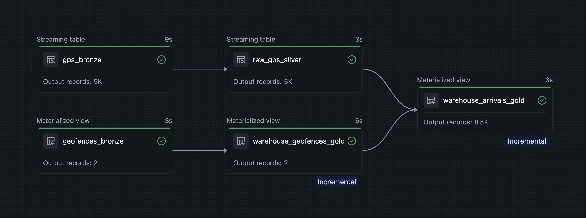

# warehouse_arrivals_dab

A Databricks sample project that demonstrates how to build a warehouse arrivals data pipeline using Declarative Automation Bundles, based on the Databricks [tutorial](https://learn.microsoft.com/en-us/azure/databricks/ldp/tutorial-spatial-pipelines) for [Lakeflow Declarative Pipelines](https://learn.microsoft.com/en-us/azure/databricks/ldp/).

This repository packages the tutorial workflow into a runnable project that you can validate, deploy, and run in Databricks Free Edition by using the Databricks CLI.

## How this project extends the tutorial

The original Databricks tutorial focuses on the core Lakeflow pipeline logic. This sample project takes that foundation and turns it into a more complete, reusable project that is easier to deploy, rerun, and adapt.

Key differences and enhancements include:

- **Bundle-based project structure**: the pipeline is packaged as a Databricks bundle, with the schema, managed volume, pipeline, and workflow job defined as deployable resources.
- **End-to-end deployment workflow**: instead of creating pieces manually, you can validate, deploy, and run the whole project through the Databricks CLI.
- **Databricks Free Edition-friendly setup**: the repository is organized so you can run the sample in a lightweight environment without needing a larger production setup.
- **Automated sample-data loading**: on the `dev` target, a workflow task loads sample GPS and geofence data before refreshing the pipeline, making repeated demo runs easier. On subsequent runs, it writes a new incremental batch of GPS data to demonstrate incremental processing, which is a core Lakeflow Declarative Pipelines pattern.
- **Parameterized reruns and resets**: the workflow accepts runtime parameters such as `reset_all`, `reset_gps`, and `reset_geofences`, so you can control how input data is regenerated.
- **Environment-aware targets**: the bundle includes a `dev` target and a starter `prod` target, making the project easier to promote beyond a single tutorial-style setup.
- **Source-controlled project layout**: pipeline code, SQL transformations, and sample-data loading logic are stored in a clean repository structure under `src/` and `resources/`.
- **Validation assets included**: the repository includes validation queries and a notebook to help verify that the gold outputs were created as expected.

In short, this repo keeps the tutorial's warehouse-arrivals example, but wraps it in a more practical project structure for local development, repeatable deployment, and iterative testing.

## Local setup

```bash
git clone https://github.com/maprihoda/warehouse_arrivals_dab.git

cd warehouse_arrivals_dab

uv sync

source .venv/bin/activate
```

## Bundle commands

Authenticate first, if needed:

```bash
databricks auth login -p <profile>
```

Validate the bundle:

```bash
databricks bundle validate
databricks bundle validate --output json     # double-check how variables were resolved
```

Deploy the bundle:

```bash
databricks bundle deploy -t dev
```

Sync local source changes into the already-deployed bundle workspace files:

```bash
databricks bundle sync -t dev
```

Use `bundle sync` during active development when you have already deployed the `dev` target and want to quickly push updated notebooks, Python files, SQL files, and other synced project assets without doing a full redeploy. This is convenient for fast iteration on code changes, but if you change bundle configuration or resource definitions in a way that affects deployment, use `databricks bundle deploy -t dev` again.

Continuously sync changes while you edit:

```bash
databricks bundle sync --watch -t dev
```

Use `--watch` when you are iterating locally and want file changes to be uploaded automatically as you save. This is especially useful while developing pipeline logic or notebooks against the `dev` target. Stop it with `Ctrl+C` when you are done. As with regular `sync`, switch back to `deploy` whenever you change infrastructure-level bundle settings or resource configuration.

### Note on dev target naming

- This bundle uses `mode: development` for the `dev` target.
- In development mode, Databricks prefixes the resource names it creates.
- For example, the schema `warehouse_arrivals` may be deployed as something like `workspace.dev_<user>_warehouse_arrivals`.
- The workflow job is configured to use the resolved schema and volume resource names, so always redeploy after changing the bundle configuration.

Run the workflow job:

```bash
databricks bundle run warehouse_arrivals_workflow
```

On the `dev` target, the job first loads sample raw GPS and geofence data into the managed volume, and then triggers the pipeline refresh. On subsequent runs, the workflow loads new sample raw GPS data.

On non-`dev` targets, the same job can be deployed without the sample-data task, so it only triggers the pipeline refresh.

A minimal `prod` target skeleton is included in `databricks.yml`. Update its `catalog` and `schema` values before deploying to production.

Run the workflow against the `dev` target (default) or the `prod` target:

```bash
databricks bundle run warehouse_arrivals_workflow
databricks bundle run -t prod warehouse_arrivals_workflow
```

Run only the pipeline (without loading new sample data):

```bash
databricks bundle run warehouse_arrivals_pipeline
```

### Example pipeline run

The screenshot below shows an example run of the workflow in Databricks:



### Parameterized runs

The `warehouse_arrivals_workflow` job accepts runtime parameters, so you can override the reset flags directly from the CLI with `--params`.

These parameters are used by the sample-data task on the `dev` target.

Examples:

```bash
# reset both GPS and geofences
databricks bundle run warehouse_arrivals_workflow \
  --params reset_all=true

# reset only GPS input
databricks bundle run warehouse_arrivals_workflow \
  --params reset_gps=true

# reset only geofences
databricks bundle run warehouse_arrivals_workflow \
  --params reset_geofences=true

# pass multiple parameters
databricks bundle run warehouse_arrivals_workflow \
  --params reset_gps=true,reset_geofences=true
```

You can also override other job parameters, such as `catalog`, `schema`, and `volume`, in the same way.

```bash
# override catalog / schema / volume
databricks bundle run warehouse_arrivals_workflow \
  --params catalog=workspace,schema=dev_marek_prihoda_warehouse_arrivals,volume=raw_data

# combine object overrides with reset flags
databricks bundle run warehouse_arrivals_workflow \
  --params catalog=workspace,schema=dev_marek_prihoda_warehouse_arrivals,volume=raw_data,reset_all=true
```

## Why `bundle_config_schema.json` is checked in

We generated the file with:

```bash
databricks bundle schema > bundle_config_schema.json
```

We then referenced it from the bundle YAML files with comments such as:

```yaml
# yaml-language-server: $schema=bundle_config_schema.json
```

Or, for files under `resources/`:

```yaml
# yaml-language-server: $schema=../bundle_config_schema.json
```

This is mainly for local authoring ergonomics. The YAML language server used by editors such as VS Code can read that schema file and then:

- validate bundle YAML structure while you type
- flag unknown or misspelled properties early
- offer autocomplete for supported bundle fields
- show inline documentation and hover help for many settings
- reduce mistakes when editing nested Databricks bundle resource definitions

In other words, it makes the bundle configuration behave more like a typed configuration file than plain YAML.

A few practical notes:

- this is an editor aid, not a runtime requirement for Databricks deployment
- the relative path in each comment matters: `databricks.yml` points to `bundle_config_schema.json`, while files in `resources/` point to `../bundle_config_schema.json`
- if you upgrade the Databricks CLI and want the latest schema, regenerate the file with `databricks bundle schema > bundle_config_schema.json`

## Validation queries

A Databricks notebook with these checks, plus additional validation queries, is available at:

- `src/warehouse_arrivals_dab/notebooks/validation_queries.ipynb`

The gold output table is `warehouse_arrivals_gold`.

```sql
SELECT warehouse_name, COUNT(*) AS arrival_count
FROM warehouse_arrivals_gold
GROUP BY warehouse_name
ORDER BY warehouse_name;
```

```sql
SELECT device_id, timestamp, warehouse_name
FROM warehouse_arrivals_gold
ORDER BY timestamp DESC
LIMIT 10;
```
